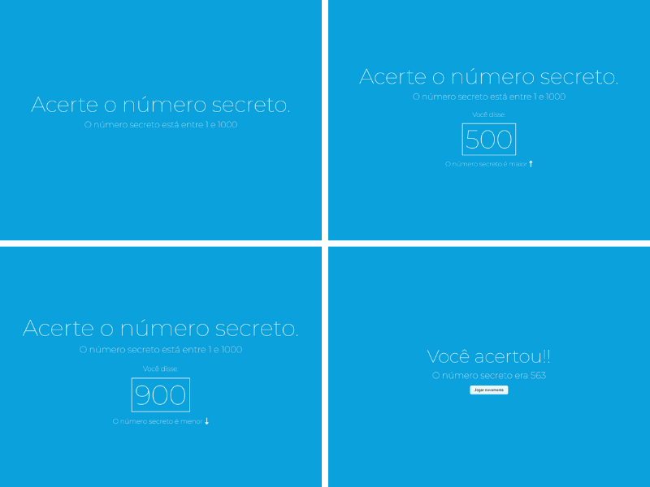

# WEB SPEECH API (SECRET NUMBER) AT ALURA

## QUICK EXPLANATION

The "Secret Number Game" is a classic guessing game that challenges participants to discover a secret number within a certain and stimulates strategic thinking and logical deduction. The Web Speech API was used to incorporate speech recognition which can interact with the game by using voice commands instead of traditional input methods.

## LAYOUT

<!-- markdownlint-disable -->

  

<!-- markdownlint-disable -->

## LIVE SERVER

In order to run install VSCode extension [`Live Server`](https://marketplace.visualstudio.com/items?itemName=ritwickdey.LiveServer)

## NEXT STEPS

- [ ] Add called numbers
- [ ] Improve button UI
- [ ] Add multiplayer

## Contributing

Any contributions you make are **greatly appreciated**.
